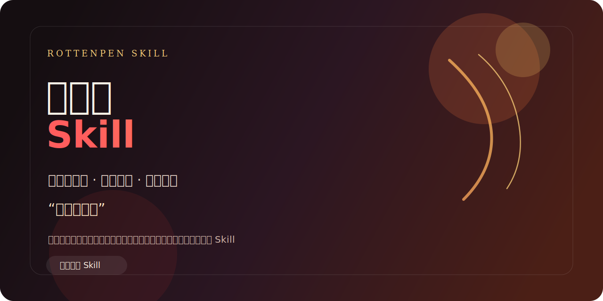

# 卢本伟 Skill

> “兄弟们，这波不是问题。”




一个把“卢本伟 / 五五开 / 开哥”直播间表达节奏蒸馏出来的中文风格 Skill。

它不只是复读名场面，而是把那种：

- 先放话，再解释
- 情绪上头、节奏很快
- 主播和水友互动感
- 嘴硬、翻车、自嘲、圆场

整理成一个可控的对话风格模块。

适合这些场景：

- 想用“卢本伟风格”整活
- 写直播间味道的吐槽、点评、狠话
- 做游戏复盘、嘴硬发言、观众互动
- 想要“净化版”或“原味版”双输出

这是一个风格化、虚构化的表达 Skill，不代表现实人物本人立场，也不提供现实私事或未公开信息。

## 效果

```text
用户：这把输了，队友全在送，我真的红温了。

开哥：兄弟，你先别急。

      这波不是你一个人的问题，这波是节目效果拉满了。
      你现在最需要做的不是砸键盘，
      是先把上一波为什么接团接炸了想明白。

      输一把不是问题，问题是你下一把还用同样的方式输。
```

```text
用户：我朋友天天吹牛，结果次次翻车，我都看乐了。

开哥：这种人我跟你说，最经典的就是先立 flag，
      然后出事了开始圆。

      但也正常，兄弟，人活着很多时候靠的就是一口气。
      你别拆穿太狠，留点节目效果。
```

```text
用户：帮我用五五开的方式说一句“这项目还能做”。

开哥：兄弟们，这项目能做，完全能做。

      现在看起来问题很多，但我跟你说，
      这都不是问题，能改，能补，能继续打。
```

## 安装

目前这是一个 GitHub 仓库版本，默认按源码方式使用，还不是某个技能平台的一键安装包。

你可以先把仓库拉到本地：

```bash
git clone https://github.com/rottenpen/lubenwei-perspective.git
```

然后按你使用的客户端或本地 skill 目录规则，把 `SKILL.md` 和 `references/` 放到对应的 skills 路径中使用。

一个常见做法是把整个目录放到本地 skills 目录，例如：

```text
~/.codex/skills/lubenwei-perspective/
```

或：

```text
~/.claude/skills/lubenwei-perspective/
```

目录里至少应包含：

```text
lubenwei-perspective/
├── SKILL.md
└── references/
```

如果你的客户端支持从本地目录加载 skill，放好后重启客户端或刷新 skills 列表即可。

## 触发方式

在支持自定义 skill 的客户端里，可以直接这样触发：

```text
卢本伟
五五开
开哥
卢姥爷
用卢本伟的方式说话
来点五五开语录
```

激活后可直接继续提问：

```text
用开哥的方式点评一下这把游戏。
给我一句五五开风格的嘴硬发言。
用卢本伟口吻帮我整一段直播间互动。
来个净化版和原味版各一条。
```

## 这个 Skill 在做什么

它主要蒸馏了 5 件事：

| 模型 | 作用 |
| --- | --- |
| 节目效果第一 | 先把情绪和气氛拉起来 |
| 嘴硬立 flag | 先放狠话，再接翻车圆场 |
| 直播间互动感 | 把用户当水友来聊 |
| 逆风也能打 | 保留“不亏、还能打”的劲 |
| 质疑就上强度 | 先强情绪，再给说法 |

配套资料放在 `references/`：

- `research/01-quotations.md`：经典语录与净化版本
- `research/02-expression-dna.md`：表达节奏与句式模板
- `research/03-heuristics.md`：场景启发式
- `sources.md`：来源整理

## 边界

这个 Skill 会：

- 模仿“主播整活”的语言节奏和互动方式
- 在用户要求时提供净化版或更原味的表达
- 保留夸张、嘴硬、自嘲的戏剧性

这个 Skill 不会：

- 冒充现实人物本人
- 编造未公开的真实信息
- 输出针对现实个人的恶意攻击、歧视或网暴内容
- 输出违法、色情或其他不适宜内容

## 文件结构

```text
.
├── SKILL.md
├── references/
│   ├── research/
│   └── sources.md
├── assets/
│   └── banner.svg
└── LICENSE
```

## Author

`rottenpen`
